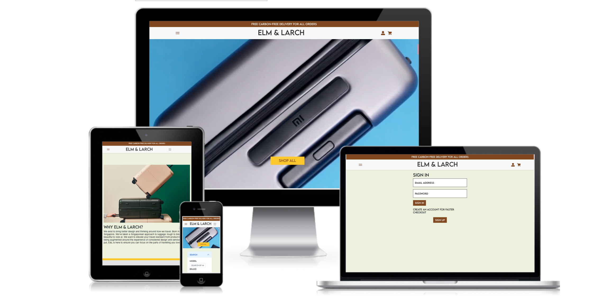
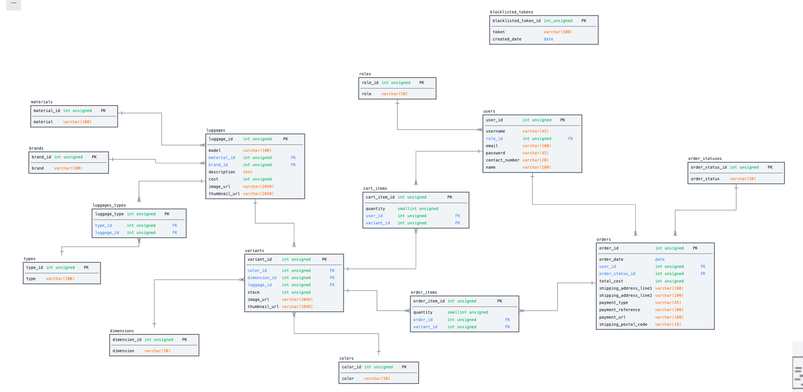
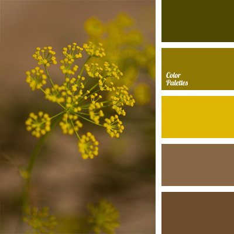

# **Elm & Larch**



Link to demo: [Elm & Larch](https://elm-and-larch.netlify.app)

#### Test Accounts:

- Backend at [Elm and Larch Express](https://project-3-elm-and-larch.onrender.com)
    - Email: tiffany@gmail.com
    - Password: tiffany

- Frontend at [Elm and Larch React](https://elm-and-larch.netlify.app)
    - Email: customer@gmail.com
    - Password: customer91

## Summary

Elm and Larch is an e-commerce web application for luggages that are produced in a sustainable way. Customers can buy luggages from top brands. These luggages are handpicked for travellers who are environment conscious and travellers who wish to buy luggages of different brands in one website.

---

## UI/UX

### Strategy

#### Organisation Goals

My organisation goals are to sell luggages and at the same time keeping the environment in mind. It is a best-stop for customers to buy luggages from different brands and materials from sustainable source. 

### User Goals

| User Stories | Acceptance Criteria |
| ------------ | ------------------- |
|As a traveller, I would like to buy a luggage for a business trip.| Customer need to search by type of traveller. |
|As an environment enthusiast, I would like to buy a luggage that is sourced from recycled materials and able to choose the different brands. |Customer need to search by brands and all the products sold should be from sustainable source.|
|As a luggage enthusiast and frequent traveller, I would like to buy a luggage within my budget. | Customer need to search by min and max price of the luggage. | 


### Structure and Skeleton

#### Database



#### Sitemap

#### Wireframes

### Design Decisions

#### Color scheme



The color scheme is inspired from a yellow flower with green stem. The color scheme was chose to represent to sustainability in the luggages that is being sold. 

#### Fonts

Lemon Milk font was used as serif to represent nature feel and also luxury in the luggage. Fira sans was used for the words to be readable and clear. 

## Features

### Backend

| Features | Description |
| -------- | ----------- |
| Admin need to have access to the backend and able to login, logout and register. | Only registered admin can access the backend application. |
| Admin need to update and see the orders | Order search and update operations can be done. |
| Admin need to be able to update, delete, create and search the luggages. | Admin can access to CRUD operations in the backend. | 


### Frontend 

| Features | Description |
| -------- | ----------- |
| Search for luggages | Customers can search by model, brand, material, min and max price. |
| Sign in, sign out, sign up | Customer can register for an account, sign in using the email address and password. Then, in the my account page, customer can sign out |
| Add, delete and update cart | After logging in, users are able to able to add product to cart, delete from cart and update the quantity in the cart.|
| Checkout | Customers are able to checkout and stripe is used to process payment. Customers will be redirected to orders page in my account after successful payment. |

## Technologies Used

### Backend

| Technology | Description |
| ----------- | ----------- |
| [Express](https://expressjs.com/) | Web application framework used |
| [Bookshelf.js](https://bookshelfjs.org/index.html) | JavaScript ORM used for querying SQL databases |
| [knex](https://knexjs.org/) | Query builder for PostgreSQL, MySQL, CockroachDB, SQL Server, SQLite3 and Oracle on node.js |
| [db-migrate](https://db-migrate.readthedocs.io/en/latest/) | Database migration framework used |
| [Axios](https://axios-http.com/docs/intro) | HTTP Client |
| [Caolan Forms](https://github.com/caolan/forms) | Create and validate forms |
| [CORS](https://www.npmjs.com/package/cors) | Middleware to enable Cross-Origin Resource Sharing (CORS) |
| [csurf](https://www.npmjs.com/package/csurf) | CSRF protection middleware |
| [dotenv](https://www.npmjs.com/package/dotenv) | To allow loading of environment variables from .env file |
| [express-session](https://www.npmjs.com/package/express-session) | Session management middleware |
| [connect-flash](https://www.npmjs.com/package/connect-flash) | Middleware to enable Flash messages |
| [express-flash](https://www.npmjs.com/package/express-flash) | Extension of connect-flash to enable definition and rendering of flash message without redirecting request  |
| [JSON Web Token](https://jwt.io/) | Authentication framework with Frontend |
| [Handlebars](https://handlebarsjs.com/) | Used to generate HTML templates for admin panel |
| [handlebars-helpers](https://github.com/helpers/handlebars-helpers) | Handlebars helpers |
| [wax-on](https://www.npmjs.com/package/wax-on) | Add support to Handlebars for template inheritance with `block` and `extends` helpers |
| [Cloudinary](https://cloudinary.com/) | Image hosting service used for upload and storage of images |


### Frontend

| Technology | Description |
| ----------- | ----------- |
| [React](https://reactjs.org/) | Frontend framework |
| [React Router DOM](https://v5.reactrouter.com/web/guides/quick-start) | Handle routing in React web application |
| [Axios](https://axios-http.com/docs/intro) | HTTP Client |
| [React Bootstrap](https://react-bootstrap.github.io/) | BootStrap for React application |
| [Bootstrap](https://getbootstrap.com/docs/5.0/getting-started/introduction/) | Used for styling of web application |
| [Font Awesome](https://fontawesome.com/) | Used for icons displayed on web application |
| [Stripe](https://stripe.com/en-sg) | Payment gateway used in web application |


---

## Testing 

The website is tested for responsiveness using Developer Tools on Chrome browser for mobile, tablet and desktop screen widths. The test cases can be found [here](readme/test-cases-elm-and-larch.pdf).

## Deployment


### Frontend

The website is hosted using [Netlify](https://www.netlify.com/), deployed directly from the main branch of this Github repository.

### Backend

The Express server is hosted using [Render](https://www.render.com/), deployed directly from the main branch of the Github repository [here](https://github.com/naushadbegum/elmandlarch-be).

The Express server makes use of the following environment variables:

```
SESSION_SECRET=

DB_DRIVER=
DB_USER=
DB_PASSWORD=
DB_DATABASE=
DB_HOST=

CLOUDINARY_NAME=
CLOUDINARY_API_KEY=
CLOUDINARY_API_SECRET=
CLOUDINARY_UPLOAD_PRESET=

TOKEN_SECRET=
REFRESH_TOKEN_SECRET=

STRIPE_PUBLISHABLE_KEY=
STRIPE_SECRET_KEY=

STRIPE_SUCCESS_URL=
STRIPE_CANCEL_URL=
STRIPE_ENDPOINT_SECRET=
```

---

## Credits and Acknowledgement

- Photos of luggages using [Paraval] (https://tourparavel.com/en-sg) [Louis Vuitton](https://ap.louisvuitton.com/eng-sg/homepage?dispatchCountry=SG) [Tumi](https://www.tumi.sg/home) [July](https://july.com/us/) [Away](https://www.awaytravel.com/)
- Responsive website mockup is created using [CreateMockup.com](https://www.createmockup.com/generate/)
- Yong Sheng, Paul, Wesley for guidance in the project
- Wesley's algorithm for selection of variants and github repository


